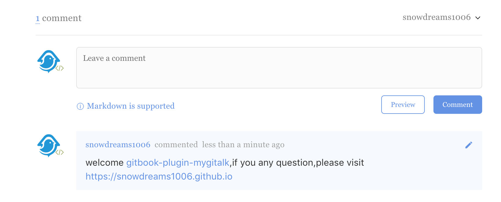

# gitbook-plugin-mygitalk

[![npm][npm-version-image]][npm-version-url] 
[![cnpm][taonpm-version-image]][taonpm-version-url]
[![cnpm-downloads][taonpm-downloads-image]][taonpm-version-url]
[![gitbook-version][gitbook-version-image]][gitbook-version-url]
[![taonpm-vulnerabilities][taonpm-vulnerabilities-image]][taonpm-vulnerabilities-url]

`Mygitalk` is a **gitbook comment plugin** based on `gitalk`.

If you want to know the story behind `mygitalk`, please visit [gitbook-plugin-mygitalk](https://snowdreams1006.github.io/gitbook-plugin-mygitalk/).



## Features

- Authentication with github account
- Serverless, all comments will be stored as github issues
- Both personal and organization github projects can be used to store comments 
- Localization, support multiple languages [en, zh-CN, zh-TW, es-ES, fr, ru]
- Facebook-like distraction free mode (Can be enabled via the `distractionFreeMode` option)
- Hotkey submit comment (cmd|ctrl + enter)

[中文说明](https://github.com/gitalk/gitalk/blob/master/readme-cn.md)
[Demo](https://gitalk.github.io)

## Install

You can install this plugin via npm:

```bash
$ npm install gitbook-plugin-mygitalk
```

Be sure to activate the option from the `book.json` file:

```json
{
    "plugins" : ["mygitalk"]
}
```

Then run `gitbook install` followed by either `gitbook serve` or `gitbook build`

## Usage

Add it to your `book.json` with a basic configuration:

```json
{
  "plugins": [ "mygitalk" ],
  "pluginsConfig": {
    "mygitalk": {
        "clientID": "GitHub Application Client ID",
        "clientSecret": "GitHub Application Client Secret",
        "repo": "GitHub repo",
        "owner": "GitHub repo owner",
        "admin": ["GitHub repo owner and collaborators, only these guys can initialize github issues"],
        "distractionFreeMode": false
    }
  }
}
```

## Options

- **clientID** `String` 

  **Required**. GitHub Application Client ID.

- **clientSecret** `String` 

  **Required**. GitHub Application Client Secret.

- **repo** `String` 

  **Required**. GitHub repository.

- **owner** `String` 

  **Required**. GitHub repository owner. Can be personal user or organization.

- **admin** `Array` 

  **Required**. GitHub repository owner and collaborators. (Users who having write access to this repository)

- **id** `String` 
  
  Default: `location.href`.

  The unique id of the page. Length must less than 50.

- **number** `Number` 
  
  Default: `-1`.

  The issue ID of the page, if the `number` attribute is not defined, issue will be located using `id`.

- **labels** `Array` 
  
  Default: `['Gitalk']`.

  GitHub issue labels.

- **title** `String` 
  
  Default: `document.title`.

  GitHub issue title.

- **body** `String` 
  
  Default: `location.href + header.meta[description]`.

  GitHub issue body.

- **language** `String` 
  
  Default: `navigator.language || navigator.userLanguage`.

  Localization language key, `en`, `zh-CN` and `zh-TW` are currently available.

- **perPage** `Number` 
  
  Default: `10`.

  Pagination size, with maximum 100.

- **distractionFreeMode** `Boolean` 
  
  Default: false.

  Facebook-like distraction free mode.

- **pagerDirection** `String`

  Default: 'last'

  Comment sorting direction, available values are `last` and `first`.

- **createIssueManually** `Boolean` 
  
  Default: `false`.

  By default, Gitalk will create a corresponding github issue for your every single page automatically when the logined user is belong to the `admin` users. You can create it manually by setting this option to `true`.

- **proxy** `String` 
  
  Default: `https://cors-anywhere.herokuapp.com/https://github.com/login/oauth/access_token`.

  GitHub oauth request reverse proxy for CORS. [Why need this?](https://github.com/isaacs/github/issues/330)

- **flipMoveOptions** `Object` 
  
  Default:
  ```js
    {
      staggerDelayBy: 150,
      appearAnimation: 'accordionVertical',
      enterAnimation: 'accordionVertical',
      leaveAnimation: 'accordionVertical',
    }
  ```

  Comment list animation. [Reference](https://github.com/joshwcomeau/react-flip-move/blob/master/documentation/enter_leave_animations.md)

- **enableHotKey** `Boolean` 
  
  Default: `true`.

  Enable hot key (cmd|ctrl + enter) submit comment.


## Contributing

1. [Fork the repository](https://github.com/gitalk/gitalk/fork) and create your branch from master
2. If you've added code that should be tested, add tests!
3. If you've changed APIs, update the documentation.
4. Ensure the test suite passes (npm test).
5. Make sure your code lints (npm run lint).
6. Commit your changes (git commit) [Commit Message Format Reference](https://github.com/angular/angular.js/blob/master/CONTRIBUTING.md#-git-commit-guidelines)

## Similar Projects

- [gitment](https://github.com/imsun/gitment)
- [vssue](https://vssue.js.org)

### change logs

#### version 0.0.6 (2016-12-06T16:54:38)

* fix: Fixed not to do anything when the width of the screen size was 600px or less (#6) 
* fix: changed the position of the bar position from "localStorage" to "sessiongStorage" (#10)

#### version 0.0.6 (2015-11-06T16:54:38)

* supported Gitbook v3

#### version 0.0.5 (2015-11-06T16:54:38)

* fixed don't work toggle button of summary view display from Gitbook V2.5.x

This software is released under the MIT License, see LICENSE.txt.

## License

`gitbook-plugin-mygitalk` is licensed under `Apache-2.0` License


[npm-version-image]: https://img.shields.io/npm/v/gitbook-plugin-mygitalk.svg?style=flat-square
[npm-version-url]: https://www.npmjs.com/package/gitbook-plugin-mygitalk
[taonpm-version-image]: https://npm.taobao.org/badge/v/gitbook-plugin-mygitalk.svg
[taonpm-version-url]: https://npm.taobao.org/package/gitbook-plugin-mygitalk
[taonpm-downloads-image]: https://npm.taobao.org/badge/d/gitbook-plugin-mygitalk.svg
[gitbook-version-image]: https://badgen.net/badge/gitbook/%3E%3D2.4.3/blue
[gitbook-version-url]: https://www.npmjs.com/package/gitbook
[taonpm-vulnerabilities-image]: https://snyk.io.cnpmjs.org/test/npm/gitbook-plugin-mygitalk/badge.svg
[taonpm-vulnerabilities-url]: https://snyk.io.cnpmjs.org/test/npm/gitbook-plugin-mygitalk


